---

i build things that reduce friction in real life — not just on screens.

my work sits at the intersection of **product engineering**, **AI/ML**, and **interaction design**. i care about the moment a person actually uses something: does it make their life easier, or just more complicated?

that question drives everything i build.

---

## what i'm about

most engineers build features. i build for the moment *after* the feature ships — when a real person opens it, confused or tired or just trying to get something done. i want that moment to feel effortless.

that means i think in systems: how the model behaves, how the interface responds, how the whole experience holds together under pressure. i work across the full stack — from training pipelines to production UI — because the best AI experiences can't be handed off between people who don't talk to each other.

---

## currently building
**[Hourflow]** — a focus-driven workspace that reduces context switching through a primary surface + transient systems model. Designed for people who think in systems, not task lists.

---

## things i've built



**[GestureDrive](https://github.com/immubashir/GestureDrive)** — Real-time hand gesture recognition for in-car control. No touchscreen. No voice. Just a camera and a model that has to be right the first time. PyTorch + MediaPipe. Reduced false positives to under 4%.

**[SleepSense](https://github.com/immubashir/sleepsense)** — Turns wearable sleep data into predictions about academic performance. The hard part wasn't the ML — it was making the output readable to a student who just wants to know if they should sleep more. Runner-up, best project @ UB CSE-587.

**[Genius](https://github.com/immubashir/genius)** — a multi-agent AI platform with five production agents: chat, coding assistant, image, video, and music generation. full stack: Next.js + Node/Express + PostgreSQL, deployed on Vercel.

**[Sociogram](https://github.com/immubashir/threads_app)** — a social platform built from scratch. auth, posts, profiles, feeds. the kind of thing you only really understand by building it yourself, end to end.

**[Fashionista](https://github.com/immubashir/fashionista)** — a full e-commerce application. product pages, cart, payments. real transactions, real edge cases.

---

## stack



```
languages     Python · TypeScript · JavaScript
frontend      React · Next.js · Tailwind CSS
backend       Node.js · Express · PostgreSQL · Flask
AI / ML       PyTorch · TensorFlow · computer vision · generative AI
design        Figma · interaction design · design systems
tooling       Cursor · Claude · Git
```

---

## how i work

i use AI tooling the way most engineers use autocomplete — it's not a party trick, it's just how i build. Cursor and Claude are open every time i write code.

i think the engineers who'll matter in the next five years are the ones who can move between the model layer and the interface layer without losing the thread of what the person on the other end actually needs.

that's what i'm trying to be.

---

## find me

[](https://kmubashir.space)
[](https://linkedin.com/in/mubashir-uddin)
[](mailto:mubashiruddinkhaja03@gmail.com)
